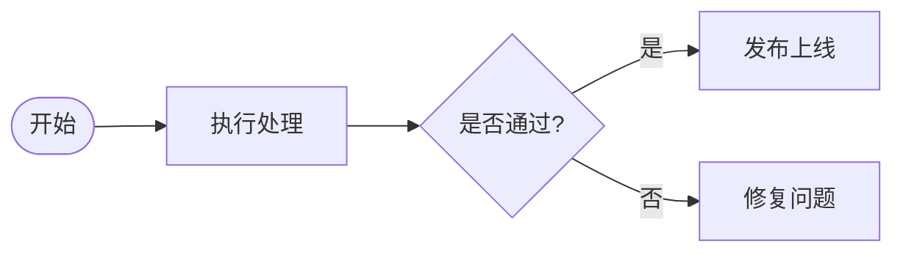
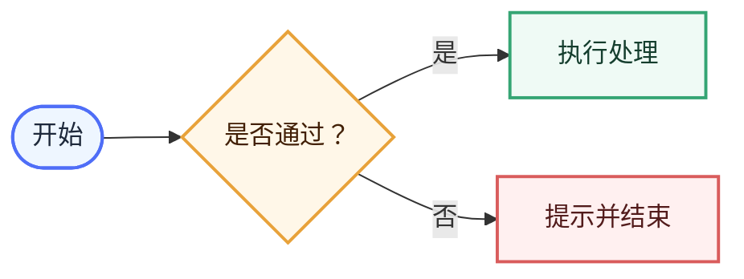

# AI Mermaid 绘图规范

> 用途：让 AI 在生成 Markdown 图表时输出结构清楚、视觉统一并兼容 Typora、Obsidian 和 GitHub 的 Mermaid。  
> 配套样式：`Ryen-Custom` 的 5 个 `Ryen ...` 主题已提供通用 Mermaid 皮肤。本文负责主题无法自动判断的布局与语义。

## 1. 基本原则

1. 图表先表达关系，再追求装饰；一个图只讲清一个核心问题。
2. 优先使用稳定的 Mermaid 标准语法，不依赖仅某个编辑器支持的实验语法。
3. 节点超过 10 个或存在 3 层以上嵌套时，优先拆成总览图和分图。
4. 中文节点使用简短短语；长解释放在图外正文，不塞进节点。
5. 含标点、括号、斜杠或特殊字符的节点文本使用引号包裹，例如 `A["登录（可选）"]`。

## 2. 布局选择

| 内容关系 | 默认方向 | 原因 |
|---|---|---|
| 线性流程、审批链、用户路径 | `flowchart LR` | 利用宽屏正文，阅读方向自然。 |
| 层级、树状结构、上下游分层 | `flowchart TD` | 上下层级更直观。 |
| 节点文字较长或分支很多 | `flowchart TD` | 避免横向过宽。 |
| 少量步骤且需要对照 | `flowchart LR` | 便于并排比较。 |

循环返回线使用虚线；主流程使用实线。边标签保持简短，例如“是”“否”“失败”。

### 自动布局边界

- Mermaid 负责自动排版；Typora 主题 CSS 只能改变颜色、边框、圆角、字体和阴影，不能指定节点坐标、固定连线路由或复刻手工 SVG 的构图。
- 同一张图存在多个返回环、跨子图连接或双向依赖时，Mermaid 可能重新排序节点并产生大跨度连线；不要假定源码书写顺序等于最终画面顺序。
- 复杂流程优先改为“无环主图”：失败节点用 `返回：某步骤` 标明去向，完整循环关系放在图后正文或独立状态图中。
- 若必须保留多个真实回环，应拆分成总览图与局部分图，并在目标 Typora 版本中实机检查；不能只用手工 SVG 或网页预览代替验收。

## 3. 节点语义

```text
([开始/结束])    起止节点
[处理步骤]       普通过程
{条件判断？}     分支判断
[(数据)]         数据或存储
[[子流程]]       可展开的子流程
```

不要把所有节点都写成普通矩形。节点形状应当表达功能，但同一张图最多使用 4 种形状。

## 4. 推荐语义颜色

通用 Ryen 皮肤会美化未指定类别的普通节点。需要强调语义时，使用以下固定类别；不要为每个节点随意创造颜色。

在 Ryen 主题环境中，优先只给节点分配以下主题语义类，不在每张图重复颜色值：



- `ryen-process`：柔紫色普通处理节点。
- `ryen-decision`：暖黄色/橙色判断节点。
- `ryen-success`：薄荷绿色开始、成功、发布和结束节点。
- `ryen-rework`：橙色补充、修改、修复和回退节点。

这些类名只表达语义；具体颜色和阴影由 5 个 Ryen 主题统一提供。



- 蓝色 `terminal`：开始、结束和关键入口。
- 橙色 `decision`：需要选择或判断的节点。
- 绿色 `process`：正常处理、成功步骤。
- 红色 `warning`：失败、阻断和风险；只在确实需要警示时使用。

## 5. 连线规则

- 主路径使用 `-->`。
- 返回、重试或辅助关系使用 `-.->`。
- 只有确实存在方向时才画箭头；不要用交叉连线制造视觉噪声。
- 尽量让“是/成功”保持直行，让“否/失败”作为侧向分支。
- 一条线只写一个短标签，不在边上写完整句子。

## 6. 输出要求

AI 输出 Mermaid 时应当：

1. 先根据内容选择 `LR` 或 `TD`，不得机械地总用 `TD`。
2. 使用语义正确的节点形状。
3. 默认依赖 Ryen 通用皮肤，不必在每张图重复粘贴 `%%{init: ...}%%`。
4. 只有文档将离开 Ryen 主题环境，或确实需要独立配色时，才在代码块内加入 `init` 和 `classDef`。
5. 生成后必须在目标编辑器中检查 Mermaid 语法、节点顺序、断线、交叉线、过长文本与渲染兼容性；复杂回环图不得仅凭代码推断布局。
6. 图后用一小段正文解释关键结论，不能让图成为唯一的信息载体。

## 7. 可加入项目指令的简版规则

```text
生成或修改 Mermaid 时，请遵循 AI-Mermaid绘图规范.md：根据关系选择 LR/TD，起止用圆角、判断用菱形、处理用矩形，主路径实线、循环或重试用虚线；控制节点数量和文字长度，优先使用兼容 Typora、Obsidian、GitHub 的稳定语法。默认依赖 Ryen Mermaid 皮肤，不重复加入全局 init 配置。
```
