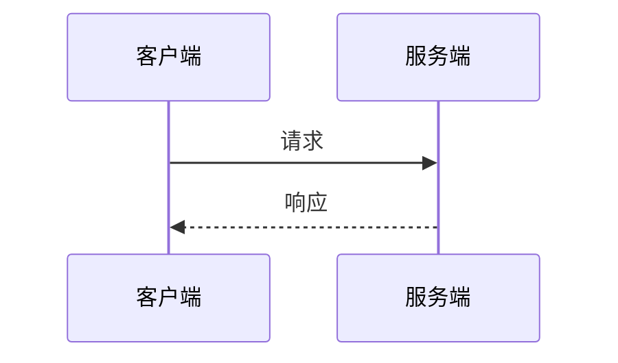
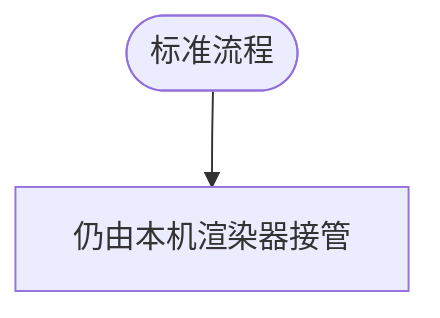

# Native Mermaid fallback

```mermaid
sequenceDiagram
    participant A as 客户端
    participant B as 服务端
    A->>B: 请求
    B-->>A: 响应
```

```mermaid
flowchart TD
    A([标准流程]) --> B[仍由本机渲染器接管]
```
