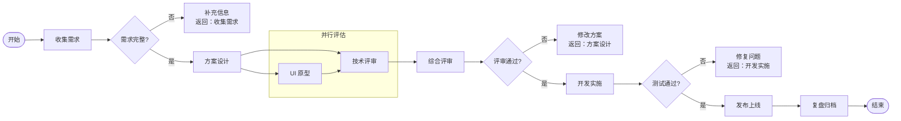

# Ryen Mermaid 避障回路测试

用于检查回路是否避开普通节点和 `subgraph` 分组框。

```mermaid
flowchart LR
    S([开始]) --> R[收集需求]
    R --> RD{需求完整?}
    RD -->|否| RF[补充信息<br/>返回：收集需求]
    RD -->|是| PLAN[方案设计]

    PLAN --> UI
    PLAN --> TECH
    subgraph PE[并行评估]
        UI[UI 原型] --> TECH[技术评审]
    end
    TECH --> REVIEW[综合评审]

    REVIEW --> AD{评审通过?}
    AD -->|否| AF[修改方案<br/>返回：方案设计]
    AD -->|是| DEV[开发实施]
    DEV --> TD{测试通过?}
    TD -->|否| TF[修复问题<br/>返回：开发实施]
    TD -->|是| PUB[发布上线]
    PUB --> ARCHIVE[复盘归档]
    ARCHIVE --> END([结束])

    class RF,AF,TF ryen-rework;
```
