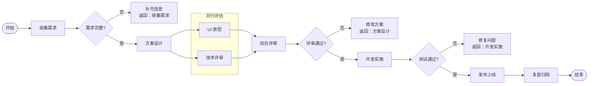
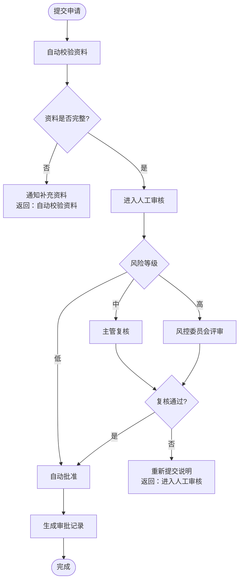
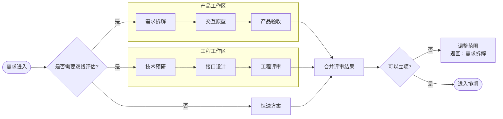
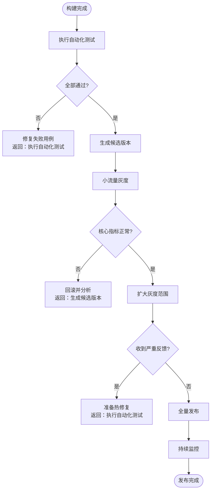
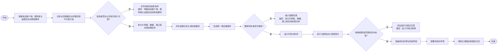
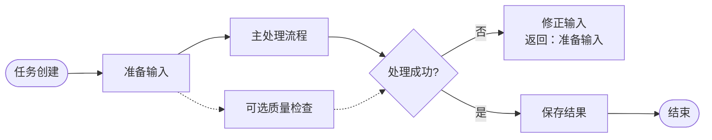

# Ryen Mermaid 多场景回归测试

这份测试稿保留上一版本的基准结构，并增加多组标准 Mermaid 流程图，用于检查布局、分支、子图、回路、长文本和多图加载。

## 1. 基准流程：并行评估与三条返工回路

## 2. 上下布局：审批分流与超时回退

## 3. 左右布局：两个并行工作区汇合

## 4. 多分支测试：发布、灰度与回滚

## 5. 长文本与蛇形换行压力测试

## 6. `graph` 别名与虚线依赖

